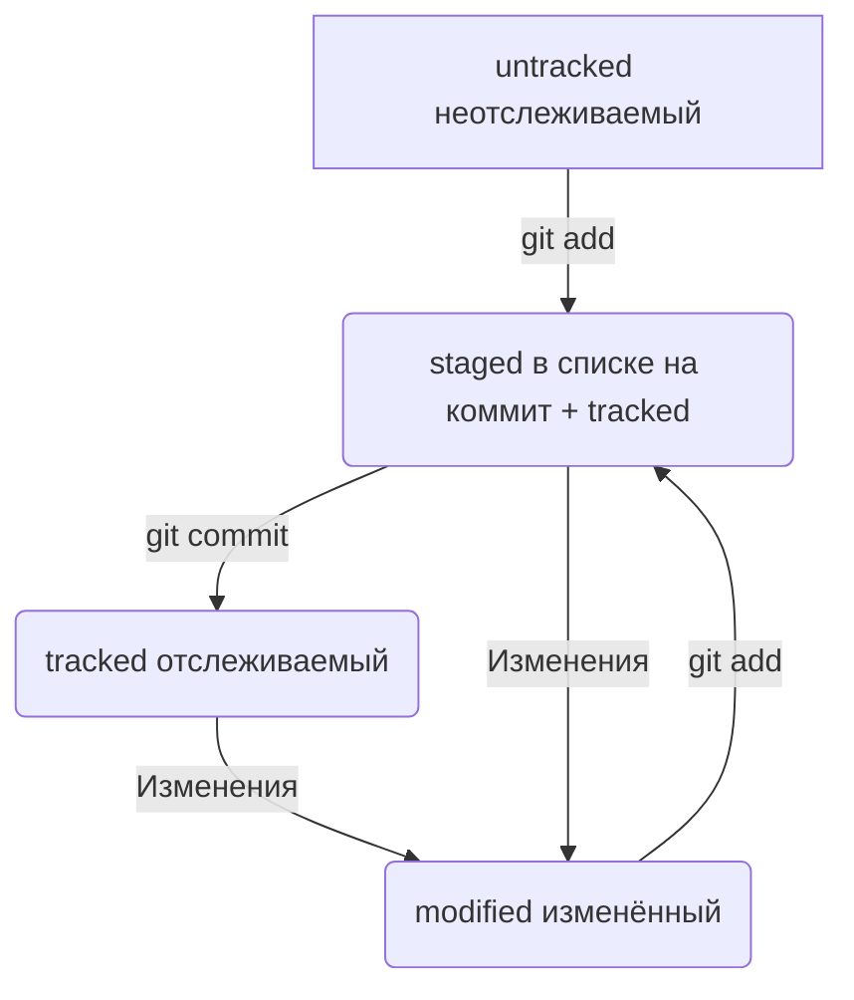

# Основные команды Git

#### Инициализация репозитория 

- **git init** — создаёт новый репозиторий Git в текущей директории.

#### Добавление файлов 

- **git add <файл>** — добавляет указанный файл в индекс (стадию). 

- git add . — добавляет все изменённые файлы в индекс.

#### Коммиты 

- **git commit -m "Сообщение о коммите"** — создаёт новый коммит с указанным сообщением. 

- git status — показывает текущее состояние репозитория (какие файлы изменены, добавлены или удалены).

#### Просмотр истории 

- **git log** — показывает историю коммитов. 

- **git log --oneline** — отображает сокращённую версию истории коммитов, по одной строке на коммит.

#### Работа с ветками 

- **git branch** — показывает список веток. 

- **git checkout <ветка>** — переключается на указанную ветку. 

- **git merge <ветка>** — объединяет указанную ветку с текущей веткой. - git branch -d <ветка> — удаляет указанную ветку.

#### Откат изменений 

- **git reset --soft <хеш_коммита>** — откатывает изменения до указанного коммита, но сохраняет изменения в индексе и рабочей директории. 

- git reset --hard <хеш_коммита> — полностью откатывает репозиторий до состояния указанного коммита.

#### Синхронизация с удалённым репозиторием 

- **git remote add origin _<url>_** — добавляет удалённый репозиторий с именем origin. 

- git push origin <ветка> — отправляет локальную ветку на удалённый репозиторий. 

- git pull origin <ветка> — извлекает изменения из удалённого репозитория и объединяет их с локальной веткой.

#### Хэш коммита

- У каждого коммита есть свой ИД (его хэш), по которому к нему можно обратиться с помощью различных команд GIT.

#### Хэш коммита в логе коммитов

- У каждого коммита, отображаемого в **git log** отображается его хэш в виде *commit _<hash>_*.

#### HEAD

- Слово HEAD является синонимом для хэша последнего коммита и может использоваться вместо него.

#### Статусы файлов

- Статусная модель файлов показана на диаграмме ниже.

#### Стили оформления сообщений к коммитам

- Вместо того чтобы написать «Изменения в коде», лучше написать «Исправлена ошибка в функции расчёта суммы заказа». Так сразу понятно, что именно было сделано.
- Корпоративный стиль: в начале коммита писать ИД задачи в корпоративном трекере задач, по которой сделано изменение.
- Conventional Commits: отличается качественной документацией и подробной проработкой. Он подходит для репозиториев с исходным кодом программ.
- GitHub-стиль: в гитхабе тоже можно вести список задач. Если так делать, то логично указывать номер, решаемой задачи в коммите. Гитхаб может автоматически привязать задачу, если в сообщении она упомянута в формате *#_111_*.
